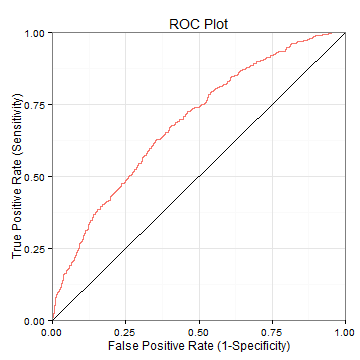

## Accuracy indicators for classification algorithms

There are several statistical measures of the performance of a binary 
classification algorithm:

1. Accuracy: $ \frac{TP+TN}{P+N} $
2. Sensitivity: $ \frac{TP}{P} = \frac{TP}{TP+FP}$
3. Specificity: $ \frac{TN}{N} = \frac{TN}{TN+FN}$
4. AUC (area under the curve)

*TP=True Positive; TN=True Negative; FP=False Positive; FN=False Negative.*

More details can be found <a href="http://en.wikipedia.org/wiki/Sensitivity_and_specificity">here</a>.

--- .class #id 

## Why AUC?

This simple application try to show why AUC is a more realistic measure than
others. Accuracy is always sensible to the overfitting to the training set.

---

## AUC and ROC curve

If AUC means Area Under the Curve, what is that curve? It's the ROC curve. It
shows that there is a trade-off between the proportion of True Positive (TP)
and the proportion of False Positive (FP).

---

## Logistic Regression Sample

Our application shows all the above with a simple logistic regression model. A
sample of the calculations done by the application:

The accuracy is 0.8375 and the AUC is 0.6879.

 
---
